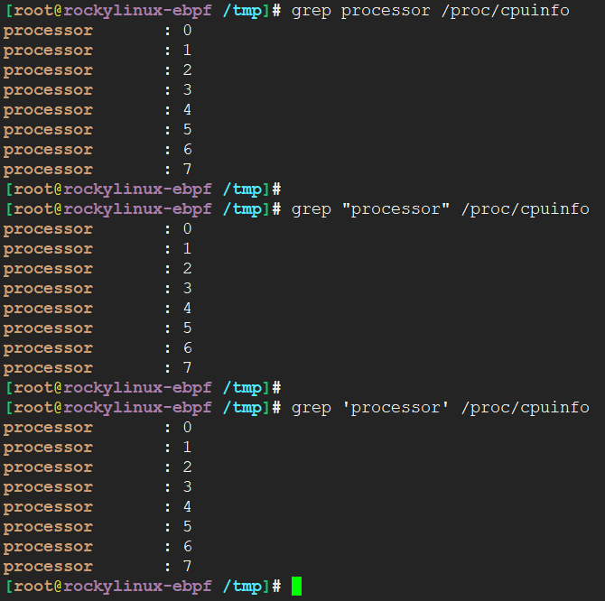
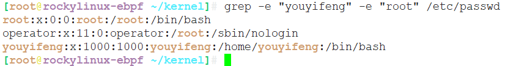
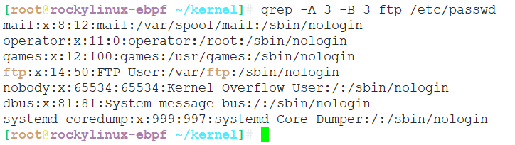
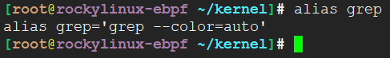
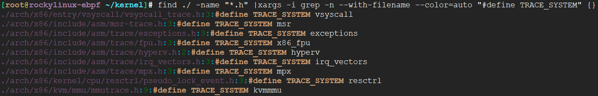
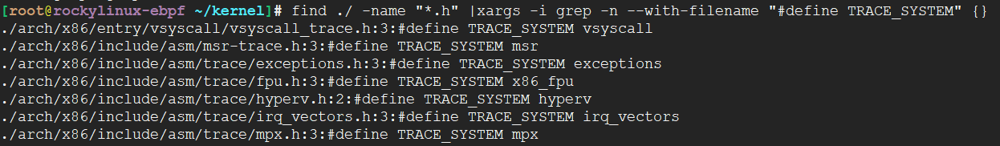
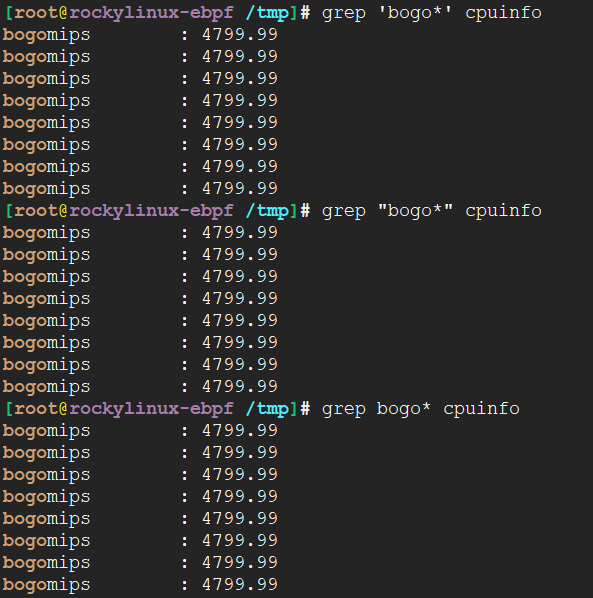
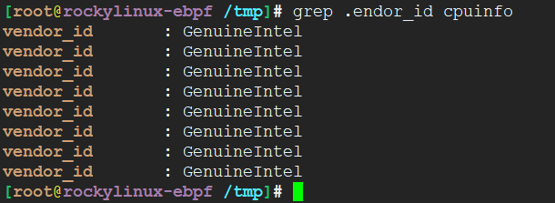
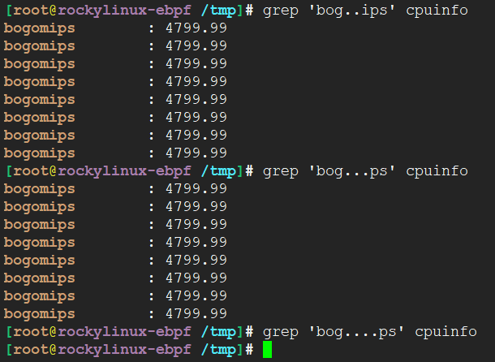
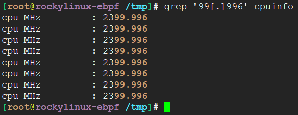

<!-- TOC -->

- [grep 用例](#grep-用例)
  - [常用选项参数](#常用选项参数)
  - [用例](#用例)
    - [匹配字符串所在行，最基本，字符串检索，行位单位显示](#匹配字符串所在行最基本字符串检索行位单位显示)
    - [递归当前目录所有文件内容，显示匹配字符串](#递归当前目录所有文件内容显示匹配字符串)
    - [与find结合，过滤特定文件，模糊搜索](#与find结合过滤特定文件模糊搜索)
    - [反向查找，显示所有不匹配的内容](#反向查找显示所有不匹配的内容)
    - [多个匹配条件](#多个匹配条件)
    - [显示匹配到的数量](#显示匹配到的数量)
    - [显示匹配到行的前后N行内容](#显示匹配到行的前后n行内容)
    - [颜色显示](#颜色显示)

<!-- /TOC -->

# grep 用例

```
grep (Globally search a Regular Expression and Print)
文本三剑客: grep 文本查找, sed 文本编辑, awk 文本分析工具
```

## 常用选项参数

* -n, --line-number 显示匹配内容所在行
* -r, --recursive 递归检索
* -i, --ignore-case 忽略大小写
* -v, --invert-match 反向匹配
* -H, --with-filename 显示文件名

## 用例

### 匹配字符串所在行，最基本，字符串检索，行位单位显示

```
grep processor /proc/cpuinfo

grep "processor" /proc/cpuinfo

grep 'processor' /proc/cpuinfo
```



### 递归当前目录所有文件内容，显示匹配字符串

```
grep -rn 'XXX'
```


### 与find结合，过滤特定文件，模糊搜索

```
find ./ -name "*.c" |xargs -i grep --with-filename -n 'DEFINE_TRACE' {}
```


### 反向查找，显示所有不匹配的内容


显示所有不包含MODULE_的内容，包含行号

```
grep -vn 'MODULE_' kernel/configs.c
```

过滤所有空行
```
grep -v "^$" /etc/ssh/sshd_config
```

### 多个匹配条件

相当于or

```
grep -e "youyifeng" -e "root" /etc/passwd
```




### 显示匹配到的数量

-c 统计数量

```
grep -cvn 'MODULE_' kernel/configs.c
```

### 显示匹配到行的前后N行内容

* -B before的行
* -A after后的行


```
grep -B 5 -A 10 -rn 'XXX'
```



### 颜色显示

默认grep不带颜色，有颜色一般是--color=auto



```
find ./ -name "*.h" |xargs -i grep -n --with-filename --color=auto "#define TRACE_SYSTEM" {}
```






### 正则匹配

* 匹配0次或多次

```
grep 'bogo*' cpuinfo

grep "bogo*" cpuinfo

grep bogo* cpuinfo
```



* 匹配除了换行符之外的所有字符，非0个

```
grep .endor_id cpuinfo
```


```
grep 'bog..ps' cpuinfo
```



* 匹配特殊字符

```
grep '99[.]996' cpuinfo
```




---
