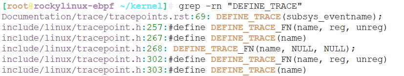
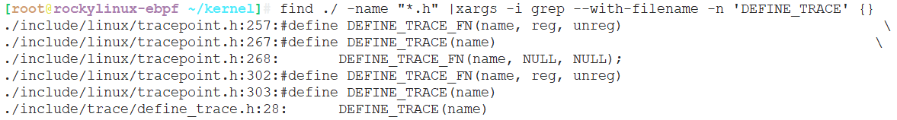

# grep 用例


## 常用选项参数

* -n, --line-number 显示匹配内容所在行
* -r, --recursive 递归检索
* -i, --ignore-case 忽略大小写


* 递归当前目录所有文件内容，显示匹配字符串

```
grep -rn 'XXX'
```




* 与find结合，过滤特定文件，模糊搜索

```
find ./ -name "*.c" |xargs -i grep --with-filename -n 'DEFINE_TRACE' {}
```




* 反向查找，显示所有不匹配的内容


显示所有不包含MODULE_的内容，包含行号

```
grep -vn 'MODULE_' kernel/configs.c
```

过滤所有空行
```
grep -v "^$" /etc/ssh/sshd_config
```


---
